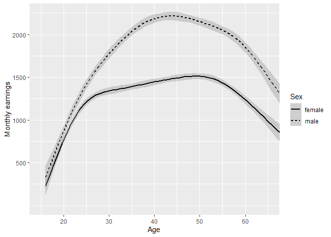
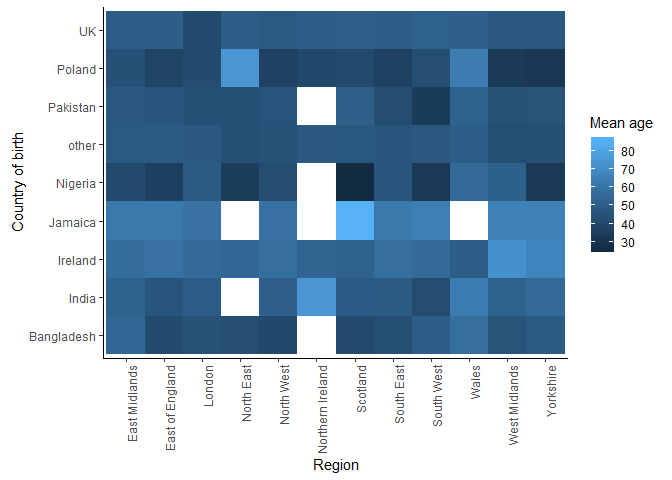
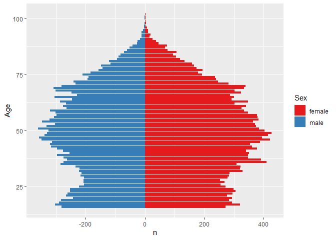

Statistical assignment 4
================
Connor Kowalewski
26/02/2020

In this assignment you will need to reproduce 5 ggplot graphs. I supply
graphs as images; you need to write the ggplot2 code to reproduce them
and knit and submit a Markdown document with the reproduced graphs (as
well as your .Rmd file).

First we will need to open and recode the data. I supply the code for
this; you only need to change the file paths.

    ```r
    library(tidyverse)
    Data8 <- read_tsv("C:/Users/conno/Downloads/DA III Data/UKDA-6614-tab/tab/ukhls_w8/h_indresp.tab")
    Data8 <- Data8 %>%
        select(pidp, h_age_dv, h_payn_dv, h_gor_dv)
    Stable <- read_tsv("C://Users/conno/Downloads/DA III Data/UKDA-6614-tab/tab/ukhls_wx/xwavedat.tab")
    Stable <- Stable %>%
        select(pidp, sex_dv, ukborn, plbornc)
    Data <- Data8 %>% left_join(Stable, "pidp")
    rm(Data8, Stable)
    Data <- Data %>%
        mutate(sex_dv = ifelse(sex_dv == 1, "male",
                           ifelse(sex_dv == 2, "female", NA))) %>%
        mutate(h_payn_dv = ifelse(h_payn_dv < 0, NA, h_payn_dv)) %>%
        mutate(h_gor_dv = recode(h_gor_dv,
                         `-9` = NA_character_,
                         `1` = "North East",
                         `2` = "North West",
                         `3` = "Yorkshire",
                         `4` = "East Midlands",
                         `5` = "West Midlands",
                         `6` = "East of England",
                         `7` = "London",
                         `8` = "South East",
                         `9` = "South West",
                         `10` = "Wales",
                         `11` = "Scotland",
                         `12` = "Northern Ireland")) %>%
        mutate(placeBorn = case_when(
                ukborn  == -9 ~ NA_character_,
                ukborn < 5 ~ "UK",
                plbornc == 5 ~ "Ireland",
                plbornc == 18 ~ "India",
                plbornc == 19 ~ "Pakistan",
                plbornc == 20 ~ "Bangladesh",
                plbornc == 10 ~ "Poland",
                plbornc == 27 ~ "Jamaica",
                plbornc == 24 ~ "Nigeria",
                TRUE ~ "other")
        )
    ```

Reproduce the following graphs as close as you can. For each graph,
write two sentences (not more\!) describing its main message.

1.  Univariate distribution (20 points)
    
    ``` r
    Data %>%
     ggplot(aes(x = h_payn_dv)) +
     geom_freqpoly() +
     labs(x = "Net monthly pay",
          y = "Number of respondents")
    ```
    
    <!-- -->

Interpretation: We can see from this graph that the majority of
respondents had a net monthly pay of between 0 and 3000. It is also
slightly skewed to the right.

2.  Line chart (20 points) The lines show the non-parametric association
    between age and monthly earnings for men and women.
    
    ``` r
    Data %>%
        ggplot(aes(x = h_age_dv, y = h_payn_dv, linetype =       sex_dv)) + 
        geom_smooth(colour = "black") + coord_cartesian(xlim = c(15, 65), ylim = c(0, 2250)) +
        scale_y_continuous(breaks = seq(500, 2000, by = 500)) +
        labs(x = "Age",
             y = "Monthly earnings", 
        linetype = "Sex")
    ```
    
    <!-- -->

Interpretation: This chart suggests that males on average have a higher
monthly earning than females. It also demonstrates that monthly earnings
are likely to peak for individuals during their 40s.

3.  Faceted bar chart (20 points)
    
    ``` r
    Data %>%
     filter(!is.na(h_payn_dv), !is.na(placeBorn), !is.na(sex_dv)) %>%
     group_by(placeBorn, sex_dv) %>%
     summarise(meanPAY = mean(h_payn_dv, na.rm = TRUE)) %>%
     ggplot(aes(x = sex_dv, y = meanPAY)) +
     geom_bar(stat = "identity") +
     facet_wrap(~ placeBorn, nrow = 3) +
     labs(x = "Sex", y = "Median monthly net pay")
    ```
    
    <!-- -->

Interpretation: These charts again suggest that regardless of place of
birth, males have a higher median monthly net pay than females. They
also demonstrate that Ireland has the highest median monthly net pay
whilst Pakistan have the lowest.

4.  Heat map (20 points)
    
    ``` r
    Data %>% 
        filter(!is.na(placeBorn), !is.na(h_gor_dv)) %>%
        group_by(placeBorn, h_gor_dv) %>%
        summarise(meanAGE = mean(h_age_dv, na.rm = TRUE)) %>%
        ggplot(aes(x = h_gor_dv, y = placeBorn)) +    
        geom_tile(aes(fill = meanAGE)) +
        theme_classic() + 
        theme(axis.text.x = element_text(angle = 90, hjust = 1)) +
        coord_equal() +
        labs(x = "Region", y = "Country of birth", fill = "Mean age")
    ```
    
    <!-- -->

Interpretation: This heat map shows that the mean age is consistent for
UK born individuals across all regions. The youngest mean age is
Nigerians living in Scotland whilst the oldest mean age is Jamaicans
living in Scotland.

5.  Population pyramid (20 points)
    
    ``` r
    ggplot(data = Data, aes(x = h_age_dv, fill = sex_dv)) + 
    geom_bar(data = dplyr::filter(Data, sex_dv == "female")) + 
    geom_bar(data = dplyr::filter(Data, sex_dv == "male"), aes(y =    ..count.. * (-1))) + 
    scale_fill_brewer(palette = "Set1") +
    coord_flip() +
    labs(x = "Age", y = "n", fill = "Sex")
    ```
    
    <!-- -->

Interpretation: This pyramid suggests that there were more female
respondents during this wave. It also shows that the distribution of age
between the sexes is consistent.
